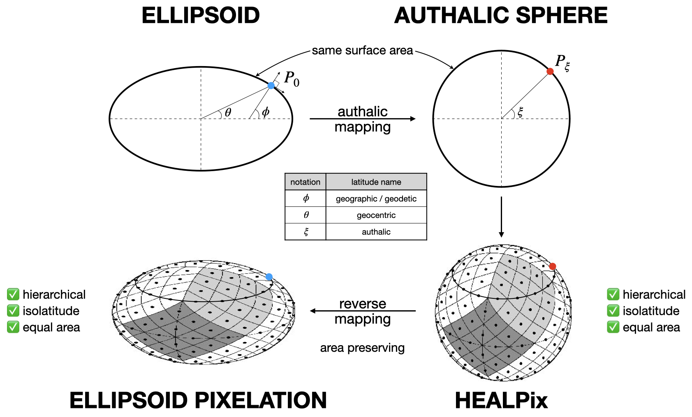

# HEALPix Extension to Ellipsoids

This page outlines an extension of the HEALPix pixelation scheme to ellipsoidal Earth models using an **authalic transformation**-a mapping to a sphere that preserves surface area.

## Why Extend HEALPix?

Standard HEALPix is defined on the sphere and provides:
- Hierarchical structure  
- Isolatitude grid  
- Equal-area pixels

However, many geospatial applications use **ellipsoidal models** (e.g. WGS84). To maintain HEALPix's properties on an ellipsoid, it is mapped to an **authalic sphere**-a sphere with the same surface area.

## Overview

1. **Authalic Mapping**  
   Geodetic latitudes ($\phi$) on the ellipsoid are mapped to authalic latitudes ($\xi$) on the sphere via an area-preserving transformation.

2. **HEALPix on the Sphere**  
   Standard HEALPix is applied on the (authalic) sphere using latitude $\xi$ and longitude $\lambda$.

3. **Optional Reverse Mapping**  
   Pixel centers or boundaries can be projected back to ellipsoidal coordinates if needed.

Authalic mappings:
- Forward: $\phi \to \xi$ (ellipsoid $\to$ sphere)  
- Reverse: $\xi \to \phi$ (sphere $\to$ ellipsoid)

## Ellipsoidal Pixelation

This method results in an **distorted HEALPix grid** on the ellipsoid, preserving equal-area properties. It is ideal for satellite data, climate grids, and DGGS applications that need to account for Earth's flattening.

## See Also

- 📄 [Reference System – HEALPix-Geo Documentation](../reference-system.md)