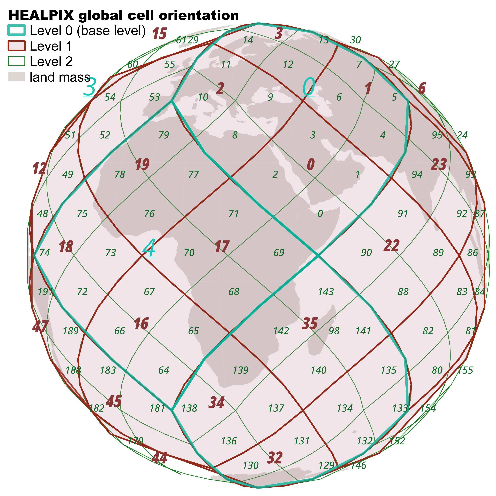

# Towards a lookup list for HEALPIX levels



## Calculating cell areas for HEALPIX levels

TODO: replace spherical calculation (here from pyresample) with [spherely](https://github.com/benbovy/spherely)

TODO: generate larger subset of cell per level and compute average cell size

TODO: compare cds-healpix and healpy cell geometries and sizes

## Overview

- generate a cell boundary coordinates (via ipix number) from cds-healpix
- creates a shapely Polygon
- calculates area in different ways: projected centered LAEA, spherical area, "guesstimate" subdivision from given Earth's surface by max number of cells in given level

## Packages used

- geopandas
- shapely
- cds-healpix-python
- pyresample (could be replaced with )
- tabulate (for markdown output)

## Cell stats

```{jupyter-execute}
---
hide-code: true
hide-output: true
---
import math
import pathlib
import re

from IPython.display import HTML
import markdown
import tabulate
import astropy.units as u
import cdshealpix as cds
import geopandas as gpd
import numpy as np
import pandas as pd
import pyresample
from pyresample.geometry import AreaDefinition
from pyresample import spherical
from shapely.geometry import Polygon, Point

# A=4πr2

# authalic 6371 km
# eqatorial 6378
radius = 6371

# 510064472 km²
# 510072000
earth_a = 510072000
earth_a_sq = math.pi * 4 * (radius * radius)

# print(earth_a , earth_a_sq)
# print(earth_a / 12)


def polygons_for_ipix(cell_ids, depth):
    lon, lat = cds.nested.vertices(cell_ids, depth, step=3)
    lon = lon.wrap_at(180 * u.deg)
    polygons = []
    for i, cell_id in enumerate(cell_ids):
        paired_2d = np.column_stack((lon.deg[i], lat.deg[i]))
        points = [Point(x, y) for (x, y) in paired_2d]
        poly = Polygon(points)
        polygons.append({"geometry": poly, "ipix": cell_id})
    return gpd.GeoDataFrame(polygons, crs=4326)


zone_col = []

for l in range(0, 30):
    max_cells = 12 * np.power(4, l)

    g = polygons_for_ipix([1], l)
    p = g.geometry[0].centroid

    laea_crs_def = f"+proj=laea +lat_0={p.y} +lon_0={p.y} +x_0=4321000 +y_0=3210000 +ellps=GRS80 +units=m +no_defs"
    heal_crs_def = "+proj=healpix"

    laea_proj = g.to_crs(laea_crs_def)

    heal_proj = g.to_crs(heal_crs_def)

    coords = list(g.geometry[0].exterior.coords)[:-1]
    coords.reverse()

    sph_poly = spherical.SphPolygon(np.deg2rad(np.array(coords)), radius=6371)

    sphere_area_km2 = sph_poly.area()
    sphere_area_m2 = sphere_area_km2 * 1000000

    laea_projected_area_m2 = laea_proj.geometry[0].area
    laea_projected_area_km2 = laea_projected_area_m2 / 1000000

    heal_projected_area_m2 = heal_proj.geometry[0].area
    heal_projected_area_km2 = heal_projected_area_m2 / 1000000

    subdivided_area_km2 = earth_a / max_cells
    subdivided_area_m2 = subdivided_area_km2 * 1000000

    zone_col.append(
        {
            "level": l,
            "num_cells": max_cells,
            # 'heal_projected_area_m2' : np.round(heal_projected_area_m2, 5),
            "laea_projected_area_m2": np.round(laea_projected_area_m2, 5),
            "sphere_area_m2": np.round(sphere_area_m2, 5),
            "subdivided_area_m2": np.round(subdivided_area_m2, 5),
            # 'heal_projected_area_km2': np.round(heal_projected_area_km2, 5),
            "laea_projected_area_km2": np.round(laea_projected_area_km2, 5),
            "sphere_area_km2": np.round(sphere_area_km2, 5),
            "subdivided_area_km2": np.round(subdivided_area_km2, 5),
            "edge_length": np.sqrt(subdivided_area_m2),
        }
    )


level_info = pd.DataFrame(zone_col).get(
    ["level", "num_cells", "subdivided_area_m2", "edge_length"]
)
formatted_table = tabulate.tabulate(
    level_info.to_dict("records"),
    headers={
        "level": "level",
        "num_cells": "# cells",
        "subdivided_area_m2": "area [m²]",
        "edge_length": "edge length [m]",
    },
    tablefmt="github",
    floatfmt=".4f",
)

col_re = re.compile(r"-(?=\|)")
table = col_re.sub(":", formatted_table)

path = pathlib.Path("healpix/healpix_levels_table.md")
path.write_text(table)
```

````{table} Healpix Level Overview
:label: tbl:healpix-levels

```{include} healpix_levels_table.md
```

````
